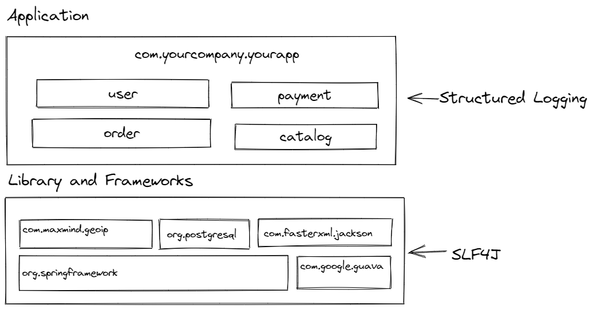

<!---freshmark shields
output = [
	link(shield('mvnrepository', 'mvnrepository', '{{group}}', 'blue'), 'https://mvnrepository.com/artifact/{{group}}'),
	link(shield('License Apache', 'license', 'Apache', 'blue'), 'https://tldrlegal.com/license/apache-license-2.0-(apache-2.0)'),
	].join('\n')
-->
[](https://mvnrepository.com/artifact/com.tersesystems.echopraxia)
[](https://tldrlegal.com/license/apache-license-2.0-(apache-2.0))
<!---freshmark /shields -->
# Echopraxia

[Echopraxia](https://github.com/tersesystems/echopraxia) is a Java logging API designed around structured logging, rich context, and conditional logging.  There are Logback and Log4J2 implementations, but Echopraxia's API is completely dependency-free, meaning it can be implemented with any logging API, i.e. jboss-logging, JUL, JEP 264, or even directly.

Echopraxia is a sequel to the Scala logging API [Blindsight](https://github.com/tersesystems/blindsight), hence the name: "Echopraxia is the involuntary repetition or imitation of an observed action."

Echopraxia is based around several main concepts that build and leverage on each other:

* Structured Logging (API based around structured fields and values)
* Contextual Logging (API based around building state in loggers)
* Conditions (API based around context-aware functions and dynamic scripting)
* Semantic Logging (API based around typed arguments)
* Fluent Logging (API based around log entry builder)
* Filters (pipeline for adding fields and conditions to loggers)

Although Echopraxia is tied on the backend to an implementation, it is designed to hide implementation details from you, just as SLF4J hides the details of the logging implementation.  For example, `logstash-logback-encoder` provides `Markers` or `StructuredArguments`, but you will not see them in the API.  Instead, Echopraxia works with independent `Field` and `Value` objects that are converted by a `CoreLogger` provided by an implementation `LogstashCoreLogger` which converts fields into `StructuredArguments` on the backend.

Please see the [blog posts](https://tersesystems.com/category/logging/) for more background on logging stuff.

## Examples 

Simple examples and integrations with [dropwizard metrics](https://metrics.dropwizard.io/4.2.0/) and [OSHI](https://github.com/oshi/oshi) are available at [echopraxia-examples](https://github.com/tersesystems/echopraxia-examples).

For a web application example,
see this [Spring Boot Project](https://github.com/tersesystems/echopraxia-spring-boot-example).0

## Statement of Intent

**Echopraxia is not a replacement for SLF4J**.  It is not an attempt to compete with Log4J2 API, JUL, commons-logging for the title of "one true logging API" and restart the [logging mess](https://techblog.bozho.net/the-logging-mess/).  SLF4J won that fight [a long time ago](https://www.semanticscholar.org/paper/Studying-the-Use-of-Java-Logging-Utilities-in-the-Chen-Jiang/be39720a72f04c92b9aece9548171d5fa3a627e6).

Echopraxia is a structured logging API.  It is an appropriate solution **when you control the logging implementation** and have decided you're going to do structured logging, e.g. a web application where you've decided to use [logstash-logback-encoder](https://github.com/logfellow/logstash-logback-encoder) already. 

SLF4J is an appropriate solution **when you do not control the logging output**, e.g. in an open-source library that could be used in arbitrary situations by anybody.  



Echopraxia is best described as a specialization or augmentation for application code -- as you're building framework support code for your application and build up your domain objects, you can write custom field builders, then log everywhere in your application with a consistent schema.

### Why Structured Logging?

Structured logging enables logs to be queried as [semi-structured](https://en.wikipedia.org/wiki/Semi-structured_data).  There are other structured logging frameworks, like [Structlog](https://www.structlog.org/en/stable/) (Python), [Ruby-Cabin](https://github.com/jordansissel/ruby-cabin) (Ruby), [Logrus](https://github.com/sirupsen/logrus) (Go), and [Serilog](https://serilog.net/) (C#).

[Ruby-Cabin](https://github.com/jordansissel/ruby-cabin) has the best take on this:

> Structured data means you don't need crazy regular expression skills to make sense of logs.

You can read more about structured logging [here](https://tersesystems.com/blog/2020/03/10/a-taxonomy-of-logging/).

### Why Conditions?

Conditions address the challenge of "whether-to-log", which concerns with dynamically adjusting the degree of logging in response to the runtime requirements.  

A proof of concept of dynamic debug logging using Echopraxia is [here](https://github.com/tersesystems/dynamic-debug-logging) .

[A Comprehensive Survey of Logging in Software](https://arxiv.org/pdf/2110.12489.pdf) and [The Bones of the System: A Study of Logging and Telemetry at Microsoft](https://www.microsoft.com/en-us/research/publication/case-the-bones-of-the-system-a-study-of-logging-and-telemetry-at-microsoft/) are great discussions of the implication of being able to adjust logging conditions at runtime.

## Benchmarks

Benchmarks are available at [BENCHMARKS.md](BENCHMARKS.md).

Please be aware that how fast and how much you can log is [dramatically impacted](https://tersesystems.com/blog/2019/06/03/application-logging-in-java-part-6/) by your use of an asynchronous appender, your available I/O, your storage, and your ability to manage and process logs.

## Logstash

There is a Logback implementation based around [logstash-logback-encoder](https://github.com/logfellow/logstash-logback-encoder).  This library does not provide a front end logger API, so you must pick (or create) one yourself, i.e. normal, async, fluent, or semantic.  

Maven:

```
<dependency>
  <groupId>com.tersesystems.echopraxia</groupId>
  <artifactId>logstash</artifactId>
  <version><VERSION></version>
</dependency>
```

Gradle:

```
implementation "com.tersesystems.echopraxia:logstash:<VERSION>" 
```

## Log4J

There is a Log4J implementation that works with the [JSON Template Layout](https://logging.apache.org/log4j/2.x/manual/json-template-layout.html).  This provides a core logger implementation but does not provide a user visible logging API.

Maven:

```
<dependency>
  <groupId>com.tersesystems.echopraxia</groupId>
  <artifactId>log4j</artifactId>
  <version><VERSION></version>
</dependency>
```

Gradle:

```
implementation "com.tersesystems.echopraxia:log4j:<VERSION>" 
```

You will need to integrate the `com.tersesystems.echopraxia.log4j.layout` package into your `log4j2.xml` file, e.g. by using the `packages` attribute, and add an `EventTemplateAdditionalField` element:

```xml
<?xml version="1.0" encoding="UTF-8"?>
<Configuration status="WARN" packages="com.tersesystems.echopraxia.log4j.layout">
    <Appenders>
        <Console name="Console" target="SYSTEM_OUT" follow="true">
            <JsonTemplateLayout eventTemplateUri="classpath:LogstashJsonEventLayoutV1.json">
                <EventTemplateAdditionalField
                        key="fields"
                        format="JSON"
                        value='{"$resolver": "echopraxiaFields"}'/>
            </JsonTemplateLayout>
        </Console>
    </Appenders>
    <Loggers>
        <Root level="info">
            <AppenderRef ref="Console" />
        </Root>
    </Loggers>
</Configuration>
```

If you want to separate the context fields from the argument fields, you can define them separately:

```xml
<JsonTemplateLayout eventTemplateUri="classpath:LogstashJsonEventLayoutV1.json">
    <EventTemplateAdditionalField
            key="arguments"
            format="JSON"
            value='{"$resolver": "echopraxiaArgumentFields"}'/>
    <EventTemplateAdditionalField
            key="context"
            format="JSON"
            value='{"$resolver": "echopraxiaContextFields"}'/>
</JsonTemplateLayout>
```

Unfortunately, I don't know of a way to "flatten" fields so that they show up on the root object instead of under an additional field.  If you know how to do this, let me know!

## Basic Usage

For most, you will be working with the basic logger, which uses a pluggable `FieldBuilder`.  The logger API is a separate dependency -- if you want, you can easily create your own custom logger, so the logger is not packaged with the API.

Maven:

```
<dependency>
  <groupId>com.tersesystems.echopraxia</groupId>
  <artifactId>logger</artifactId>
  <version><VERSION></version>
</dependency>
```

Gradle:

```
implementation "com.tersesystems.echopraxia:logger:<VERSION>" 
```

Add the import:

```
import com.tersesystems.echopraxia.*;
```

First you define a logger (usually in a controller or singleton -- `getClass()` is particularly useful for abstract controllers):

```java
final Logger<?> basicLogger = LoggerFactory.getLogger(getClass());
```

Logging simple messages and exceptions are done as in SLF4J: 

```java
try {
  ...
  basicLogger.info("Simple message");
} catch (Exception e) {
  basicLogger.error("Error message", e);  
}
```

However, when you log arguments, you pass a function which provides you with a field builder and returns a `FieldBuilderResult` -- a `Field` is a `FieldBuilderResult`, so you can do:

```java
basicLogger.info("Message name {}", fb -> fb.string("name", "value"));
```

If you are returning multiple fields, then using `fb.list` will return a `FieldBuilderResult`:

```java
basicLogger.info("Message name {} age {}", fb -> fb.list(
  fb.string("name", "value"),
  fb.number("age", 13)
));
```

And `fb.list` can take many inputs as needed, for example a stream:

```java
String[]
basicLogger.info("Message name {}", fb -> {
  Stream<Field> fieldStream = ...;
  fb.list(arrayOfFields);
});
```

You can log multiple arguments and include the exception if you want the stack trace:

```java
basicLogger.info("Message name {}", fb -> fb.list(
  fb.string("name", "value"),
  fb.exception(e)
));
```

In older versions, `fb.only()` was required to convert a `Field` -- this is no longer required, but a `FieldBuilderWithOnly` interface is available to maintain those methods.

Note that unlike SLF4J, you don't have to worry about including the exception as an argument "swallowing" the stacktrace.  If an exception is present, it's always applied to the underlying logger.

So far so good. But logging strings and numbers can get tedious.  Let's go into custom field builders.  

### Custom Field Builders

Echopraxia lets you specify custom field builders whenever you want to log domain objects:

```java
import com.tersesystems.echopraxia.api.*;

public class BuilderWithDate implements FieldBuilder {
  public BuilderWithDate() {}

  // Renders a date as an ISO 8601 string.
  public Value.StringValue dateValue(Date date) {
    return Value.string(DateTimeFormatter.ISO_INSTANT.format(date.toInstant()));
  }

  public Field date(String name, Date date) {
    return value(name, dateValue(date));
  }
}
```

And now you can render a date automatically:

```java
Logger<BuilderWithDate> dateLogger = basicLogger.withFieldBuilder(BuilderWithDate.class);
dateLogger.info("Date {}", fb -> fb.date("creation_date", new Date()));
```

This also applies to more complex objects.  In the [custom field builder example](https://github.com/tersesystems/echopraxia-examples/blob/main/custom-field-builder/README.md), the `Person` class is rendered using a custom field builder:

```java
public class PersonFieldBuilder implements FieldBuilder {

  // Renders a `Person` as an object field.
  public Field person(String fieldName, Person p) {
    return keyValue(fieldName, personValue(p));
  }

  public Value<?> personValue(Person p) {
    if (p == null) {
      return Value.nullValue();
    }
    Field name = string("name", p.name());
    Field age = number("age", p.age());
    // optional returns either an object value or null value, keyValue is untyped
    Field father = keyValue("father", Value.optional(p.getFather().map(this::personValue)));
    Field mother = keyValue("mother", Value.optional(p.getMother().map(this::personValue)));
    Field interests = array("interests", p.interests());
    return Value.object(name, age, father, mother, interests);
  }
}
```

And then you can do the same by calling `fb.person`:

```java
Person user = ...
Logger<PersonFieldBuilder> personLogger = basicLogger.withFieldBuilder(PersonFieldBuilder.class);
personLogger.info("Person {}", fb -> fb.person("user", user));
```

### Custom Logger Factories

If you are using a particular set of field builders for your domain and want them available by default, it's easy to create your own logger with your own field builder, using the support classes and interfaces.  

Creating your own logger will also remove the type parameter from your code, so you don't have to type `Logger<?>` everywhere, and allow you to create custom methods that leverage field builders.

If you want to make sure your logger is the only one available, you should import only the API:

Maven:

```
<dependency>
  <groupId>com.tersesystems.echopraxia</groupId>
  <artifactId>api</artifactId>
  <version><VERSION></version>
</dependency>
```

Gradle:

```
implementation "com.tersesystems.echopraxia:api:<VERSION>" 
```

And then continuing on from the [custom field builder example](https://github.com/tersesystems/echopraxia-examples/blob/main/custom-field-builder/README.md), you can build a `PersonLogger`:

```java
import com.tersesystems.echopraxia.api.*;

public final class PersonLogger extends AbstractLoggerSupport<PersonLogger, PersonFieldBuilder>
  implements DefaultLoggerMethods<PersonFieldBuilder> {
  private static final String FQCN = PersonLogger.class.getName();

  protected PersonLogger(
    @NotNull CoreLogger core, @NotNull PersonFieldBuilder fieldBuilder, Class<?> selfType) {
    super(core, fieldBuilder, selfType);
  }

  public void info(@Nullable String message, Person person) {
    // when using custom methods, you must specify the caller as the class it's defined in.
    this.core().withFQCN(FQCN).log(Level.INFO, message,
      fb -> fb.person("person", person), fieldBuilder);
  }

  @Override
  protected @NotNull PersonLogger newLogger(CoreLogger core) {
    return new PersonLogger(core, fieldBuilder(), PersonLogger.class);
  }

  @Override
  protected @NotNull PersonLogger neverLogger() {
    return new PersonLogger(
      core.withCondition(Condition.never()), fieldBuilder(), PersonLogger.class);
  }
}
```

and a custom logger factory:

```java
public final class PersonLoggerFactory {

  private static final PersonFieldBuilder myFieldBuilder = new PersonFieldBuilder();

  // the class containing the error/warn/info/debug/trace methods
  private static final String FQCN = DefaultLoggerMethods.class.getName();

  public static PersonLogger getLogger(Class<?> clazz) {
    return getLogger(CoreLoggerFactory.getLogger(FQCN, clazz.getName()));
  }

  public static PersonLogger getLogger(String name) {
    return getLogger(CoreLoggerFactory.getLogger(FQCN, name));
  }

  public static PersonLogger getLogger() {
    return getLogger(CoreLoggerFactory.getLogger(FQCN, Caller.resolveClassName()));
  }

  public static PersonLogger getLogger(@NotNull CoreLogger core) {
    return new PersonLogger(core, myFieldBuilder, PersonLogger.class);
  }
}
```

and then you can log a person as a raw parameter:

```java
PersonLogger logger = PersonLoggerFactory.getLogger();
Person abe = ...
logger.info("Best person: {}", abe);
```

Generally loggers should be final, and any common functionality should be moved out to interfaces you can share.  This is because subclassing can have an impact on JVM optimizations, and can make returning specific types from `with*` methods more complicated. 

### Nulls and Exceptions

By default, values are `@NotNull`, and passing in `null` to values is not recommended.  If you want to handle nulls, you can extend the field builder as necessary:

```java
public interface NullableFieldBuilder extends FieldBuilder {
  // extend as necessary
  default Field nullableString(String name, String nullableString) {
    Value<?> nullableValue = (value == null) ? Value.nullValue() : Value.string(nullableString);
    return keyValue(name, nullableValue);
  }
}
```

Field names are never allowed to be null.  If a field name is null, it will be replaced at runtime with `unknown-echopraxia-N` where N is an incrementing number.

```java
logger.info("Message name {}", fb -> 
  fb.string(null, "some-value") // null field names not allowed
);
```

Because a field builder function runs in a closure, if an exception occurs it will be caught by the default thread exception handler.  If it's the main thread, it will print to console and terminate the JVM, but other threads [will swallow the exception whole](https://stackoverflow.com/questions/24834702/do-errors-thrown-within-uncaughtexceptionhandler-get-swallowed).  Consider setting a [default thread exception handler](https://www.logicbig.com/tutorials/core-java-tutorial/java-se-api/default-uncaught-exception-handler.html) that additionally logs, and avoid uncaught exceptions in field builder closures:

```java
logger.info("Message name {}", fb -> {
  String name = methodThatThrowsException(); // BAD
  return fb.string(name, "some-value");
});
```

Instead, only call field builder methods inside the closure and keep any construction logic outside:

```java
String name = methodThatThrowsException(); // GOOD
logger.info("Message name {}", fb -> {
  return fb.string(name, "some-value");
});
```

## Context

You can also add fields directly to the logger using `logger.withFields` for contextual logging:

```java
Logger<?> loggerWithFoo = basicLogger.withFields(fb -> fb.string("foo", "bar"));

// will log "foo": "bar" field in a JSON appender.
loggerWithFoo.info("JSON field will log automatically") 
```

This works very well for HTTP session and request data such as correlation ids.

One thing to be aware of that the popular idiom of using `public static final Logger<?> logger` can be limiting in cases where you want to include context data.  For example, if you have a number of objects with their own internal state, it may be more appropriate to create a logger field on the object.

```java
public class PlayerData {

  // the date is scoped to an instance of this player
  private Date lastAccessedDate = new Date();

  // logger is not static because lastAccessedDate is an instance variable
  private final Logger<BuilderWithDate> logger =
      LoggerFactory.getLogger()
          .withFieldBuilder(BuilderWithDate.class)
          .withFields(fb -> fb.date("last_accessed_date", lastAccessedDate));

}
```

Because values may be tied to state or variables that can change between method calls, the function call made by `withFields` is [call by name](https://en.wikipedia.org/wiki/Evaluation_strategy#Call_by_name) i.e. the function is called on every logging statement for evaluation against any conditions and the logging statement will contain whatever the current value of `lastAccessedDate` at evaluation.

It's important to note that context evaluation only happens after enabled checks.  For example, `isInfoEnabled` will not trigger context evaluation by itself.  However, any implementation specific markers attached to the context will be passed in for the enabled check, as both Logback and Log4J incorporate marker checks in `isEnabled`.

```java
// will not evaluate context fields
// will evaluate any impl-specific markers (Logback or Log4J)
boolean enabled = logger.isInfoEnabled();
```

The way that context works in conjunction with conditions is more involved, and is covered in the conditions section.

### Thread Context

You can also resolve any fields in Mapped Diagnostic Context (MDC) into fields, using `logger.withThreadContext()`.  This method provides a pre-built function that calls `fb.string` for each entry in the map.

Because MDC is thread local, if you pass the logger between threads or use asynchronous processing i.e. `CompletionStage/CompletableFuture`, you may have inconsistent results.

```java
org.slf4j.MDC.put("mdckey", "mdcvalue");
myLogger.withThreadContext().info("This statement has MDC values in context");
```

This method is call by name, and so will provide the MDC state as fields at the time the logging statement is evaluated.

### Thread Safety

Thread safety is something to be aware of when using context fields.  While fields are thread-safe and using a context is far more convenient than using MDC, you do still have to be aware when you are accessing non-thread safe state.

For example, `SimpleDateFormat` is infamously not thread-safe, and so the following code is not safe to use in a multi-threaded context:

```java
private final static DateFormat df = new SimpleDateFormat("yyyyMMdd");

// UNSAFE EXAMPLE
private static final Logger<?> logger =
        LoggerFactory.getLogger()
        .withFields(fb -> fb.string("unsafe_date", df.format(new Date())));
```

## Conditions

Logging conditions can be handled gracefully using `Condition` functions.  A `Condition` will take a `Level` and a `LoggingContext` which will return the fields of the logger.

```java
final Condition errorCondition = new Condition() {
  @Override
  public boolean test(Level level, LoggingContext context) {
    return level.equals(Level.ERROR);
  }
};
```

Conditions can be used either on the logger, on the statement, or against the predicate check.

There are two elemental conditions, `Condition.always()` and `Condition.never()`.  Echopraxia has optimizations for conditions; it will treat `Condition.always()` as a no-op, and return a `NeverLogger` that has no operations for logging.  The JVM can recognize that logging has no effect at all, and will [eliminate the method call as dead code](https://shipilev.net/jvm/anatomy-quarks/27-compiler-blackholes/).

Conditions are a great way to manage diagnostic logging in your application with more flexibility than global log levels can provide. Consider enabling setting your application logging to `DEBUG` i.e. `<logger name="your.application.package" level="DEBUG"/>` and using [conditions to turn on and off debugging as needed](https://tersesystems.com/blog/2019/07/22/targeted-diagnostic-logging-in-production/).  Conditions come with `and`, `or`, and `xor` functionality, and can provide more precise and expressive logging criteria than can be managed with filters and markers.  This is particularly useful when combined with [filters](#filters).

For example, if you want to have logging that only activates during business hours, you can use the following:

```java
import com.tersesystems.echopraxia.Condition;

public class MyBusinessConditions {
  private static final Clock officeClock = Clock.system(ZoneId.of("America/Los_Angeles")) ;

  public Condition businessHoursOnly() {
    return Condition.operational().and(weekdays().and(from9to5()));
  }
  
  public Condition weekdays() {
    return (level, context) -> {
      LocalDate now = LocalDate.now(officeClock);
      final DayOfWeek dayOfWeek = now.getDayOfWeek();
      return ! (dayOfWeek.equals(DayOfWeek.SATURDAY) || dayOfWeek.equals(DayOfWeek.SUNDAY));
    };
  }
  
  public Condition from9to5() {
    return (level, context) -> LocalTime.now(officeClock).query(temporal -> {
      // hour is zero based, so adjust for readability
      final int hour = temporal.get(ChronoField.HOUR_OF_DAY) + 1;
      return (hour >= 9) && (hour <= 17); // 8 am to 5 pm
    });
  }
}
```

This is only a part of the available functionality in conditions.  You can tie conditions directly to a backend, such as a database or key/value store, or trigger them to work in response to an exception or unusual metrics.  See the [redis example](https://github.com/tersesystems/echopraxia-examples/tree/main/redis), [jmx example](https://github.com/tersesystems/echopraxia-examples/tree/main/jmx), [metrics example](https://github.com/tersesystems/echopraxia-examples/tree/main/metrics), and [timed diagnostic example](https://github.com/tersesystems/echopraxia-examples/tree/main/timed-diagnostic).

### JSON Path

In situations where you're looking through fields for a condition, you can use [JSONPath](https://github.com/json-path/JsonPath#jayway-jsonpath) to find values from the logging context in a condition.

Tip: You can integrate IntelliJ IDEA with JSONPath using the [inject language](https://www.jetbrains.com/idea/guide/tips/evaluate-json-path-expressions/) settings page and adding `LoggingContext`.

The `context.find*` methods take a class as a type, and a [JSON path](https://www.ietf.org/archive/id/draft-ietf-jsonpath-base-03.html), which can be used to search through context fields (or arguments, if the condition is used in a logging statement).

The basic types are `String`, the `Number` subclasses such as `Integer`, and `Boolean`.  If no matching path is found, an empty `Optional` is returned.

```java
Optional<String> optName = context.findString("$.person.name");
```

This also applies to `Throwable` which are usually passed in as arguments:

```java
Optional<Throwable> optThrowable = context.findThrowable();
```

You can treat a `Throwable` as a JSON object, i.e. the following will all work with the default `$.exception` path:

```java
Optional<String> className = ctx.findString("$.exception.className");
Optional<String> message = ctx.findString("$.exception.message");
Optional<Throwable> cause = ctx.findThrowable("$.exception.cause");
```

And you can also query stack trace elements:

```java
Optional<Map<String, ?>> stacktraceElement = ctx.findObject("$.exception.stackTrace[0]")
Optional<String> methodName = ctx.findString("$.exception.stackTrace[0].methodName");
Optional<List<?>> listOfElements = ctx.findObject("$.exception.stackTrace[5..10]")
```

Finding an explicitly null value returns a `boolean`:

```java
// fb.nullValue("keyWithNullValue") sets an explicitly null value
boolean isNull = context.findNull("$.keyWithNullValue");
```

Finding an object will return a `Map`:

```java
Optional<Map<String, ?>> mother = context.findObject("$.person.mother");
```

For a `List`, in the case of an array value or when using indefinite queries:

```java
List<String> interests = context.findList("$.person.mother.interests");
```

You can use [inline predicates](https://github.com/json-path/JsonPath#inline-predicates), which will return a `List` of the results:

```java
final Condition cheapBookCondition =
  (level, context) -> ! context.findList("$.store.book[?(@.price < 10)]").isEmpty();
```

The inline and filter predicates are not available for exceptions. Instead, you must use `filter`:

```java
class FindException {
  void logException() {
    Condition throwableCondition =
      (level, ctx) ->
        ctx.findThrowable()
          .filter(e -> "test message".equals(e.getMessage()))
          .isPresent();
    
    logger.error(throwableCondition, "Error message", new RuntimeException("test message"));
  }
}
```

There are many more options available using JSONPath.  You can try out the [online evaluator](https://jsonpath.herokuapp.com/) to test out expressions.


### Logger

You can use conditions in a logger, and statements will only log if the condition is met:

```java
Logger<?> loggerWithCondition = logger.withCondition(condition);
```

You can also build up conditions:

```java
Logger<?> loggerWithAandB = logger.withCondition(conditionA).withCondition(conditionB);
```

Conditions are only evaluated once a level/marker check is passed, so something like

```java
loggerWithAandB.trace("some message");
```

will short circuit on the level check before any condition is reached.

Conditions look for fields, but those fields can come from *either* context or argument.  For example, the following condition will log because the condition finds an argument field:

```java
Condition cond = (level, ctx) -> ctx.findString("somename").isPresent();
logger.withCondition(cond).info("some message", fb -> fb.string("somename", "somevalue")); // matches argument
```

### Statement

You can also use conditions in an individual statement:

```java
logger.info(mustHaveFoo, "Only log if foo is present");
```

### Predicates

Conditions can also be used in predicate blocks for expensive objects.

```java
if (logger.isInfoEnabled(condition)) {
  // only true if condition and is info  
}
```

Conditions will only be checked after an `isEnabled` check is passed -- the level (and optional marker) is always checked first, before any conditions.

A condition may also evaluate context fields that are set in a logger:

```java
// Conditions may evaluate context
Condition cond = (level, ctx) -> ctx.findString("somename").isPresent();
boolean loggerEnabled = logger
  .withFields(fb -> fb.string("somename", "somevalue"))
  .withCondition(condition)
  .isInfoEnabled();
```

Using a predicate with a condition does not trigger any logging, so it can be a nice way to "dry run" a condition.  Note that the context evaluation takes place every time a condition is run, so doing something like this is not good:

```java
Logger<?> loggerWithContextAndCondition =  logger
  .withFields(fb -> fb.string("somename", "somevalue"))
  .withCondition(condition);

// check evaluates context
if (loggerWithContextAndCondition.isInfoEnabled()) {
  // info statement _also_ evaluates context
  loggerWithContextAndCondition.info("some message");
}
```

This results in the context being evaluated both in the block and in the info statement itself, which is inefficient.

It is generally preferable to pass in a condition explicitly on the statement, as it will only evaluate once.

```java
Logger<?> loggerWithContext = logger
  .withFields(fb -> fb.string("somename", "somevalue"))
loggerWithContext.info(condition, "message");
```

or just on the statement.

```java
loggerWithContextAndCondition.info("some message");
```

## Asynchronous Logging

By default, conditions are evaluated in the running thread.  This can be a problem if conditions rely on external elements such as network calls or database lookups, or involve resources with locks.

Echopraxia provides an `AsyncLogger` that will evaluate conditions and log using another executor, so that the main business logic thread is not blocked on execution.  All statements are placed on a work queue and run on a thread specified by the executor at a later time.

### Installation

Maven:

```
<dependency>
  <groupId>com.tersesystems.echopraxia</groupId>
  <artifactId>async</artifactId>
  <version><VERSION></version>
</dependency>
```

Gradle:

```
implementation "com.tersesystems.echopraxia:async:<VERSION>" 
```

### Usage

All the usual logging statements are available in `AsyncLogger`, i.e. `logger.debug` will log as usual.  

However, there are no `isLogging*` methods in the `AsyncLogger`. Instead, a `Consumer` of `LoggerHandle` is used, which serves the same purpose as the `if (isLogging*()) { .. }` block.

```java
import com.tersesystems.echopraxia.async.*;

AsyncLogger<?> logger = AsyncLoggerFactory.getLogger().withExecutor(loggingExecutor);
logger.info(handle -> {
  // do conditional logic that would normally happen in an if block
  // this may be expensive or blocking because it runs asynchronously
  handle.log("Message template {}", fb -> fb.string("foo", "bar");
});
```

In the unfortunate event of an exception, the underlying  logger will be called at `error` level from the relevant core logger:

```java
// only happens if uncaught exception from consumer
slf4jLogger.error("Uncaught exception when running asyncLog", cause);
```

One important detail is that the logging executor should be a daemon thread, so that it does not block JVM exit:

```java
private static final Executor loggingExecutor =
  Executors.newSingleThreadExecutor(
      r -> {
        Thread t = new Thread(r);
        t.setDaemon(true); // daemon means the thread won't stop JVM from exiting
        t.setName("logging-thread");
        return t;
      });
```

Using a single thread executor is nice because you can keep ordering of your logging statements, but it may not scale up in production.  Generally speaking, if you are CPU bound and want to distribute load over several cores, you should use `ForkJoinPool.commonPool()` or a bounded fork-join work stealing pool as your executor.  If your conditions involve blocking, or work is IO bound, you should configure a thread pool executor.  

Likewise, if your conditions involve calls to external services (for example, calling Consul or a remote HTTP service), you should consider using a failure handling library like [failsafe](https://failsafe.dev/) to set up appropriate circuit breakers, bulkheads, timeouts, and rate limiters to manage interactions.

Because of parallelism and concurrency, your logging statements may not appear in order if you have multiple threads running in your executor.  You can add extra fields to ensure you can reorder statements appropriately.

Putting it all together:

```java
public class Async {
  private static final ExecutorService loggingExecutor =
      Executors.newSingleThreadExecutor(
          r -> {
            Thread t = new Thread(r);
            t.setDaemon(true); // daemon means the thread won't stop JVM from exiting
            t.setName("echopraxia-logging-thread");
            return t;
          });

  private static final Condition expensiveCondition = new Condition() {
    @Override
    public boolean test(Level level, LoggingContext context) {
      try {
        Thread.sleep(1000L);
        return true;
      } catch (InterruptedException e) {
        return false;
      }
    };
  };

  private static final AsyncLogger<?> logger = AsyncLoggerFactory.getLogger()
    .withExecutor(loggingExecutor)
    .withCondition(expensiveCondition);

  public static void main(String[] args) throws InterruptedException {
    System.out.println("BEFORE logging block");
    for (int i = 0; i < 10; i++) {
      // This should take no time on the rendering thread :-)
      logger.info("Prints out after expensive condition");
    }
    System.out.println("AFTER logging block");
    System.out.println("Sleeping so that the JVM stays up");
    Thread.sleep(1001L * 10L);
  }
}
```

Please see the [async example](https://github.com/tersesystems/echopraxia-examples/tree/main/async) for more details.

### Managing Thread Local State 

Note that because logging is asynchronous, you must be very careful when accessing thread local state.  Thread local state associated with logging, i.e. MDC / ThreadContext is automatically carried through, but in some cases you may need to do additional work.

For example, if you are using Spring Boot and are using `RequestContextHolder.getRequestAttributes()` when constructing context fields, you must call `RequestContextHolder.setRequestAttributes(requestAttributes)` so that the attributes are available to the thread.

You can add hooks into the logger to get and set thread local state appropriately using the `withThreadLocal` method, which returns a `Supplier<Runnable>`, where the `Supplier` is the "get" and the `Runnable` is the "set".  For example, in the [echopraxia-spring-boot-example](https://github.com/tersesystems/echopraxia-spring-boot-example), request attributes are thread local and must be carried across to the logging executor:

```java
class GreetingController {
  private static final AsyncLogger<?> asyncLogger =
    AsyncLoggerFactory.getLogger()
      .withFieldBuilder(HttpRequestFieldBuilder.class)
      .withThreadLocal(
        () -> {
          // get the request attributes in rendering thread...
          final RequestAttributes requestAttributes =
            RequestContextHolder.currentRequestAttributes();
          // ...and the "set" in the runnable will be called in the logging executor's thread
          return () -> RequestContextHolder.setRequestAttributes(requestAttributes);
        })
      .withFields(fb -> fb.requestFields(httpServletRequest()));

  private HttpServletRequest httpServletRequest() {
    return ((ServletRequestAttributes) RequestContextHolder.getRequestAttributes())
      .getRequest();
  }
}
```

You can call `withThreadLocal` multiple times, and it will compose with earlier blocks.

### Managing Caller Info

Caller information -- the caller class, method, and line number -- is typically implemented in frameworks by processing a stacktrace.  This is a problem for asynchronous logging, because the caller information is in a different ~~castle~~thread.

Echopraxia can fix this by capturing the caller information just before starting the async thread, but it must do so on request.  Crucially, although the throwable is created, the processing of stack trace elements still happens on the executor thread, ameliorating the [cost of caller information](https://ionutbalosin.com/2018/06/an-even-faster-way-than-stackwalker-api-for-asynchronously-processing-the-stack-frames/).

You must specifically configure the implementation to capture async caller data.

#### Log4J

For Log4J, you must set `includeLocation=true` on the logger you want to capture caller data, and configure the appender to render caller data:

```xml
<Configuration packages="...">
  <Appenders>
    <Console name="Console" target="SYSTEM_OUT">
        <!-- must have location info enabled to get caller data -->
        <JsonTemplateLayout 
          eventTemplateUri="classpath:JsonLayout.json" 
          locationInfoEnabled="true">
            
        </JsonTemplateLayout>
    </Console>
  </Appenders>
    
  <Loggers>
    <!-- Must set includeLocation=true specifically for async caller info -->
    <Root level="debug" includeLocation="true">
      <AppenderRef ref="Console"/>
    </Root>
</Loggers>
</Configuration>      
```

#### Logback

Logback is a little more complicated, because there is no direct way to get the logging event from a logger.  Instead, a special `caller` marker is added, and an appender is used to extract caller data from the marker and set it on the event, 

To enable it, you must set the context property `echopraxia.async.caller` to `true`, and wrap your appenders with `com.tersesystems.echopraxia.logstash.CallerDataAppender`:

```xml
<configuration>
    
    <property scope="context" name="echopraxia.async.caller" value="true"/>

    <!-- loosen the rule so appenders use appender-refs -->
    <newRule pattern="*/appender/appender-ref"
             actionClass="ch.qos.logback.core.joran.action.AppenderRefAction"/>

    <appender name="CONSOLE" class="ch.qos.logback.core.ConsoleAppender">
        <!-- https://logback.qos.ch/manual/layouts.html#caller -->
        <encoder>
            <pattern>%date{H:mm:ss.SSS} %highlight(%-5level) [%thread]: %message%n%ex%caller{2}</pattern>
        </encoder>
    </appender>
    
    <appender name="JSON" class="net.logstash.logback.appender.LoggingEventAsyncDisruptorAppender">
      <appender class="ch.qos.logback.core.FileAppender">
        <filename>application.log</filename>
        <!-- Or https://github.com/logfellow/logstash-logback-encoder#caller-info-fields -->
        <encoder class="net.logstash.logback.encoder.LoggingEventCompositeJsonEncoder">
          <providers>
            <!-- must add caller data to see method / line info in json -->
            <callerData/>
          </providers>
        </encoder>
      </appender>
    </appender>

    <root level="INFO">
        <!--
           CallerDataAppender sets the caller data on event from marker.
           Note this depends on setting the newRule above!
         -->
        <appender class="com.tersesystems.echopraxia.logstash.CallerDataAppender">
            <appender-ref ref="CONSOLE"/>
            <appender-ref ref="JSON"/>
        </appender>
    </root>
</configuration>
```

## Dynamic Conditions with Scripts

One of the limitations of logging is that it's not that easy to change logging levels in an application at run-time.  In modern applications, you typically have complex inputs and may want to enable logging for some very specific inputs without turning on your logging globally.

Script Conditions lets you tie your conditions to scripts that you can change and re-evaluate at runtime.

The security concerns surrounding Groovy or Javascript make them unsuitable in a logging environment.  Fortunately, Echopraxia provides a [Tweakflow](https://twineworks.github.io/tweakflow) script integration that lets you evaluate logging statements **safely**.  

Tweakflow comes with a [VS Code integration](https://marketplace.visualstudio.com/items?itemName=twineworks.tweakflow), a [reference guide](https://twineworks.github.io/tweakflow/reference.html), and a [standard library](https://twineworks.github.io/tweakflow/modules/std.html) that contains useful regular expression and date manipulation logic.

### Script Syntax

The call site for a script is the function `evaluate` inside a library called `echopraxia`.  The level and context are
passed through as `(string level, dict ctx)`, where `ctx` is a dictionary of functions that connect back to the logging context.

Methods in the context are snake case, separated by underscores. For example, to call the equivalent of `ctx.findString("$.person.name")`, you would call `ctx[:find_string]("$.person.name")`.  You can use the `let` construct in Tweakflow to make this clearer:

```
library echopraxia {
  function evaluate: (string level, dict ctx) ->
    let {
      find_string: ctx[:find_string];
    }
    find_string("$.person.name") == "testing";
}
```

You can get access to the raw fields of the logging context with `ctx[:fields]`, although this will iterate over every field and is less efficient than using the `find` functions:

```
library echopraxia {
  function evaluate: (string level, dict ctx) ->
    let {
      fields: ctx[:fields]();
    }
    fields[:name] = "Will";
}
```

Using `find_object` or `find_list` returns the appropriate type of `dict` or `list` respectively.  

```
library echopraxia {
  function evaluate: (string level, dict ctx) ->
    let {
      find_list: ctx[:find_list];
      interests: find_list("$.obj.interests");
    }
    interests[1] == "drink";
}
```

And you can use the Tweakflow standard library to allow for more advanced functionality, i.e.

```
import * as std from "std";
alias std.strings as str;
library echopraxia {
  function evaluate: (string level, dict ctx) ->
    let {
      find_string: ctx[:find_string];
    }
    str.lower_case(find_string("$.person.name")) == "will";
}
```

### Creating Script Conditions

The simplest way to handle a script is to pass it in directly as a string:

```java
import com.tersesystems.echopraxia.scripting.*;

StringBuilder b = new StringBuilder("");
b.append("library echopraxia {");
b.append("  function evaluate: (string level, dict ctx) ->");
b.append("    level == \"info\";");
b.append("}");
String scriptString = b.toString();  
Condition c = ScriptCondition.create(false, scriptString, Throwable::printStackTrace);
```

You can also use a `Path` for file based scripts:

```java
import com.tersesystems.echopraxia.scripting.*;

Path path = Paths.get("src/test/tweakflow/condition.tf");
Condition condition = ScriptCondition.create(false, path, Throwable::printStackTrace);

Logger<?> logger = LoggerFactory.getLogger(getClass()).withCondition(condition);
```

Where `condition.tf` contains a tweakflow script, e.g.

```tweakflow
import * as std from "std";
alias std.strings as str;

library echopraxia {
  # level: the logging level
  # ctx: the logging context
  function evaluate: (string level, dict ctx) ->
    {
      let find_string: ctx[:find_string]
    }
    str.lower_case(find_string("$.person.name")) == "will";   
}
```

You also have the option to store scripts in a key-value store or in a database.  See the [sqlite condition store example](https://github.com/tersesystems/echopraxia-examples/tree/main/conditionstore) for details.

### Watched Scripts

You can change file based scripts while the application is running, if they are in a directory watched by `ScriptWatchService`.

To configure `ScriptWatchService`, pass it the directory that contains your script files:

```java
final Path watchedDir = Paths.get("/your/script/directory");
ScriptWatchService watchService = new ScriptWatchService(watchedDir);

Path filePath = watchedDir.resolve("myscript.tf");

Logger logger = LoggerFactory.getLogger();

final ScriptHandle watchedHandle = watchService.watchScript(filePath, 
        e -> logger.error("Script compilation error", e));
final Condition condition = ScriptCondition.create(watchedHandle);

logger.info(condition, "Statement only logs if condition is met!")
        
// After that, you can edit myscript.tf and the condition will 
// re-evaluate the script as needed automatically!
        
// You can delete the file, but doing so will log a warning from `ScriptWatchService`
// Recreating a deleted file will trigger an evaluation, same as modification.

// Note that the watch service creates a daemon thread to watch the directory.
// To free up the thread and stop watching, you should call close() as appropriate:
watchService.close();
```

Please see the [scripting example](https://github.com/tersesystems/echopraxia-examples/blob/main/script) for more details.

### Installation

Because Scripting has a dependency on Tweakflow, it is broken out into a distinct library that you must add to your build.

Maven:

```
<dependency>
  <groupId>com.tersesystems.echopraxia</groupId>
  <artifactId>scripting</artifactId>
  <version><VERSION></version>
</dependency>
```

Gradle:

```
implementation "com.tersesystems.echopraxia:scripting:<VERSION>" 
```

## Semantic Logging

Semantic Loggers are strongly typed, and will only log a particular kind of argument.  All the work of field building and setting up a message is done from setup.

### Basic Usage

To set up a logger for a `Person` with `name` and `age` properties, you would do the following:

```java
import com.tersesystems.echopraxia.semantic.*;

SemanticLogger<Person> logger =
    SemanticLoggerFactory.getLogger(
        getClass(),
        Person.class,
        person -> "person.name = {}, person.age = {}",
        p -> fb -> fb.list(fb.string("name", p.name), fb.number("age", p.age)));

Person person = new Person("Eloise", 1);
logger.info(person);
```

### Conditions

Semantic loggers take conditions in the same way that other loggers do, either through predicate:

```java
if (logger.isInfoEnabled(condition)) {
  logger.info(person);
}
```

or directly on the method:

```java
logger.info(condition, person);
```

or on the logger:

```java
logger.withCondition(condition).info(person);
```

### Context

Semantic loggers can add fields to context in the same way other loggers do.

```java
SemanticLogger<Person> loggerWithContext =
  logger.withFields(fb -> fb.string("some_context_field", contextValue));
```

### Installation

Semantic Loggers have a dependency on the `api` module, but do not have any implementation dependencies.

Maven:

```
<dependency>
  <groupId>com.tersesystems.echopraxia</groupId>
  <artifactId>semantic</artifactId>
  <version><VERSION></version>
</dependency>
```

Gradle:

```
implementation "com.tersesystems.echopraxia:semantic:<VERSION>" 
```

## Fluent Logging

Fluent logging is done using a `FluentLoggerFactory`.  

It is useful in situations where arguments may need to be built up over time.

```java
import com.tersesystems.echopraxia.fluent.*;

FluentLogger<?> logger = FluentLoggerFactory.getLogger(getClass());

Person person = new Person("Eloise", 1);

logger
    .atInfo()
    .message("name = {}, age = {}")
    .argument(fb -> fb.string("name", person.name))
    .argument(fb -> fb.number("age", person.age))
    .log();
```

### Installation

Fluent Loggers have a dependency on the `api` module, but do not have any implementation dependencies.

Maven:

```
<dependency>
  <groupId>com.tersesystems.echopraxia</groupId>
  <artifactId>fluent</artifactId>
  <version><VERSION></version>
</dependency>
```

Gradle:

```
implementation "com.tersesystems.echopraxia:fluent:<VERSION>" 
```

## Core Logger 

Because Echopraxia provides its own implementation independent API, some implementation features are not exposed normally.  If you want to use implementation specific features like markers, you will need to use a core logger.

### Logstash API

First, import the `logstash` package.  This gets you access to the `CoreLoggerFactory` and  `CoreLogger`, which can be cast to `LogstashCoreLogger`:

```java
import com.tersesystems.echopraxia.logstash.*;
import com.tersesystems.echopraxia.api.*;

LogstashCoreLogger core = (LogstashCoreLogger) CoreLoggerFactory.getLogger();
```

The `LogstashCoreLogger` has a `withMarkers` method that takes an SLF4J marker:

```java
Logger<?> logger = LoggerFactory.getLogger(
      core.withMarkers(MarkerFactory.getMarker("SECURITY")), FieldBuilder.instance);
```

If you have markers set as context, you can evaluate them in a condition through casting to `LogstashLoggingContext`:

```java
Condition hasAnyMarkers = (level, context) -> {
   LogstashLoggingContext c = (LogstashLoggingContext) context;
   List<org.slf4j.Marker> markers = c.getMarkers();
   return markers.size() > 0;
};
```

If you need to get at the SLF4J logger from a core logger, you can cast and call `core.logger()`:

```java
Logger<?> baseLogger = LoggerFactory.getLogger();
LogstashCoreLogger core = (LogstashCoreLogger) baseLogger.core();
org.slf4j.Logger slf4jLogger = core.logger();
```

### Log4J

Similar to Logstash, you can get access to Log4J specific features by importing 

```java
import com.tersesystems.echopraxia.log4j.*;
import com.tersesystems.echopraxia.api.*;

Log4JCoreLogger core = (Log4JCoreLogger) CoreLoggerFactory.getLogger();
```

The `Log4JCoreLogger` has a `withMarker` method that takes a Log4J marker:

```java
final Marker securityMarker = MarkerManager.getMarker("SECURITY");
Logger<?> logger = LoggerFactory.getLogger(
      core.withMarker(securityMarker), FieldBuilder.instance);
```

If you have a marker set as context, you can evaluate it in a condition through casting to `Log4JLoggingContext`:

```java
Condition hasAnyMarkers = (level, context) -> {
   Log4JLoggingContext c = (Log4JLoggingContext) context;
   Marker m = c.getMarker();
   return securityMarker.equals(m);
};
```

If you need to get the Log4j logger from a core logger, you can cast and call `core.logger()`:

```java
Logger<?> baseLogger = LoggerFactory.getLogger();
Log4JCoreLogger core = (Log4JCoreLogger) baseLogger.core();
org.apache.logging.log4j.Logger log4jLogger = core.logger();
```

## Filters

There are times when you want to add a field or a condition to all loggers.  Although you can wrap individual loggers or create your own wrapper around `LoggerFactory`, this can be a labor-intensive process that requires lots of code modification, and must be handled for fluent, semantic, async, and regular loggers.

Echopraxia includes filters that wrap around the `CoreLogger` returned by `CoreLoggerFactory` that provides the ability to modify the core logger from a single pipeline in the code.

For example, to add a `uses_filter` field to every Echopraxia logger:

```java
package example;

import com.tersesystems.echopraxia.api.*;

public class ExampleFilter implements CoreLoggerFilter {
  @Override
  public CoreLogger apply(CoreLogger coreLogger) {
    return coreLogger
        .withFields(fb -> fb.bool("uses_filter", true), FieldBuilder.instance());
  }
}
```

Filters must extend the `CoreLoggerFilter` interface, and must have a no-args constructor.

Filters must have a fully qualified class name in the `/echopraxia.properties` file as a resource somewhere in your classpath.  The format is `filter.N` where N is the order in which filters should be loaded.

```properties
filter.0=example.ExampleFilter
```

Filters are particularly helpful when you need to provide "out of context" information for your conditions. 

For example, imagine that you have a situation in which the program uses more CPU or memory than normal in production, but works fine in a staging environment.  Using [OSHI](https://github.com/oshi/oshi) and a filter, you can provide the [machine statistics](https://speakerdeck.com/lyddonb/what-is-happening-attempting-to-understand-our-systems?slide=133) and evaluate with dynamic conditions.

```java
public class SystemInfoFilter implements CoreLoggerFilter {

  private final SystemInfo systemInfo;

  public SystemInfoFilter() {
     systemInfo = new SystemInfo();
  }

  @Override
  public CoreLogger apply(CoreLogger coreLogger) {
    HardwareAbstractionLayer hardware = systemInfo.getHardware();
    GlobalMemory mem = hardware.getMemory();
    CentralProcessor proc = hardware.getProcessor();
    double[] loadAverage = proc.getSystemLoadAverage(3);

    // Now you can add conditions based on these fields, and conditionally
    // enable logging based on your load and memory!
    return coreLogger.withFields(fb -> {
        Field loadField = fb.object("load_average", //
                fb.number("1min", loadAverage[0]), //
                fb.number("5min", loadAverage[1]), //
                fb.number("15min", loadAverage[2]));
        Field memField = fb.object("mem", //
                fb.number("available", mem.getAvailable()), //
                fb.number("total", mem.getTotal()));
        Field sysinfoField = fb.object("sysinfo", loadField, memField);
        return sysinfoField;
      }, FieldBuilder.instance());
  }
}
```

Please see the [system info example](https://github.com/tersesystems/echopraxia-examples/tree/main/system-info) for details.
