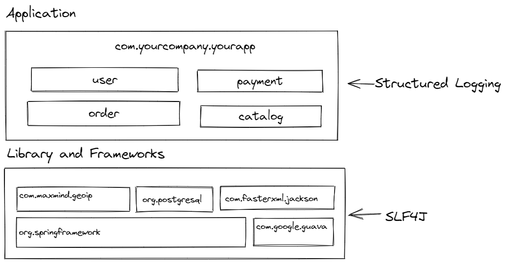

# Freqently Asked Questions

## Is this a replacement for SLF4J and/or Log4J?

**Echopraxia is not a replacement for SLF4J**.  It is not an attempt to compete with Log4J2 API, JUL, commons-logging for the title of "one true logging API" and restart the [logging mess](https://techblog.bozho.net/the-logging-mess/).  SLF4J won that fight [a long time ago](https://www.semanticscholar.org/paper/Studying-the-Use-of-Java-Logging-Utilities-in-the-Chen-Jiang/be39720a72f04c92b9aece9548171d5fa3a627e6).

Echopraxia is a structured logging API -- it gives the user the ability to provide structured input directly from the application.  It is an appropriate solution **when you control the logging implementation** and have decided you're going to do structured logging output, e.g. a web application where you've decided to use [logstash-logback-encoder](https://github.com/logfellow/logstash-logback-encoder).

SLF4J is an appropriate solution **when you do not control the logging output**, e.g. in an open-source library that could be used in arbitrary situations by anybody.  



Echopraxia is best described as a specialization or augmentation for application code -- as you're building framework support code for your application and build up your domain objects, you can write custom field builders, then log everywhere in your application with a consistent schema.

## Why Structured Logging?

Structured logging enables logs to be queried as [semi-structured data](https://en.wikipedia.org/wiki/Semi-structured_data).  There are other structured logging frameworks, like [Structlog](https://www.structlog.org/en/stable/) (Python), [Ruby-Cabin](https://github.com/jordansissel/ruby-cabin) (Ruby), [Logrus](https://github.com/sirupsen/logrus) (Go), and [Serilog](https://serilog.net/) (C#).

[Ruby-Cabin](https://github.com/jordansissel/ruby-cabin) has the best take on this:

> Structured data means you don't need crazy regular expression skills to make sense of logs.

From a logging API perspective, structured logging is interesting because it is [composable](https://en.wikipedia.org/wiki/Composability) -- structured data can be added to a logger and build up context. You can read more about structured logging [here](https://tersesystems.com/blog/2020/03/10/a-taxonomy-of-logging/).

## Why Conditions?

Conditions address the challenge of "whether-to-log", which concerns with dynamically adjusting the degree of logging in response to the runtime requirements.  A statement is only logged if it passes the condition associated with it.

Conditions can leverage the data exposed by structured logging.  For example, here's a debug statement that only logs if the remote address is localhost:

```java
JsonPathCondition isLocalhost = JsonPathCondition.pathCondition((level, ctx) -> ctx
    .findString("$.request_remote_addr")
    .map(s -> Objects.equals(s, "127.0.0.1"))
    .orElse(false));
logger.withCondition(isLocalhost).debug("address is {}", fb -> fb.string("request_remote_addr", addr));
```

This makes targeted logging far more powerful, because diagnostic logging is no longer an "all or nothing" proposition -- conditions can dynamically filter what is logged, creating a "control plane" for logging.  A proof of concept of dynamic debug logging using Echopraxia is [here](https://github.com/tersesystems/dynamic-debug-logging) .

[A Comprehensive Survey of Logging in Software](https://arxiv.org/pdf/2110.12489.pdf) and [The Bones of the System: A Study of Logging and Telemetry at Microsoft](https://www.microsoft.com/en-us/research/publication/case-the-bones-of-the-system-a-study-of-logging-and-telemetry-at-microsoft/) are great discussions of the implication of being able to adjust logging conditions at runtime.
